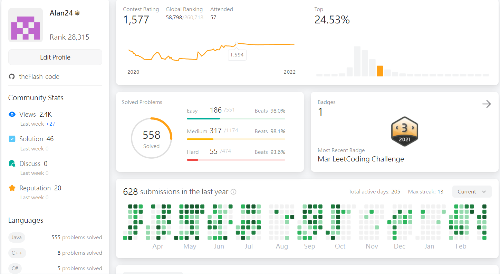

# Leetcode-solution

Hi there~  
This repository is used for documenting my journey practicing Data Structure & Algorithm with Leetcode.
click [here](https://leetcode.com/Alan24/ "Leetcode Page") to check out my Leetcode page.

image above is my Leetcode page by the time I'm writing this MarkDown file (2022/03/12)
## Programming Language
I'm currently using Java as my main programming language on leetcode.
## My story with Leetcode
I start to solve problem on leetcode since 2020 Jan, but back then I barely know anything about Data Structure & Algorithm. With the help of youtube videos and resources online, I slowly improved my skills. Now I'm enjoying coding more than ever ^.^ 
Two years after, I decided to upload my leetcode solution on github.